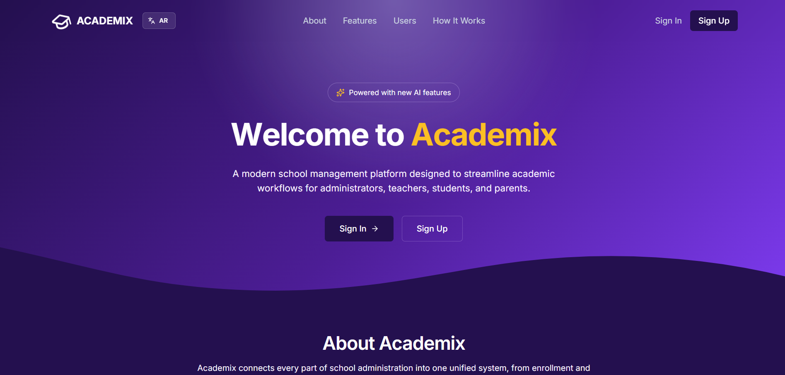
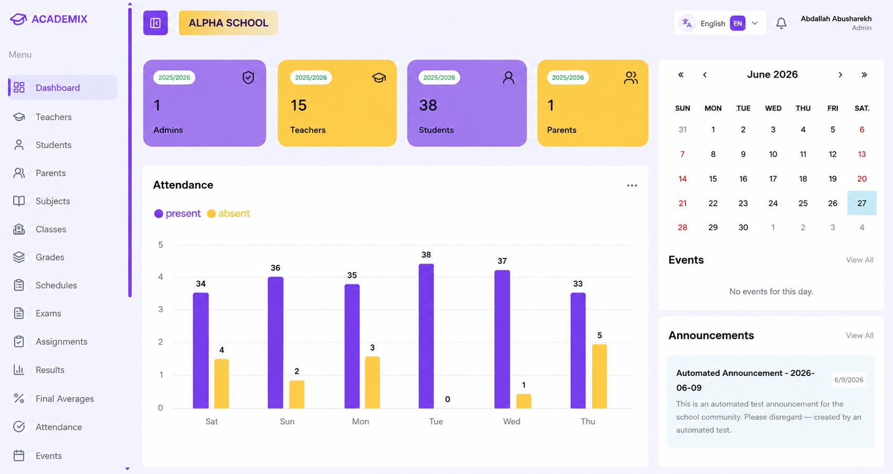
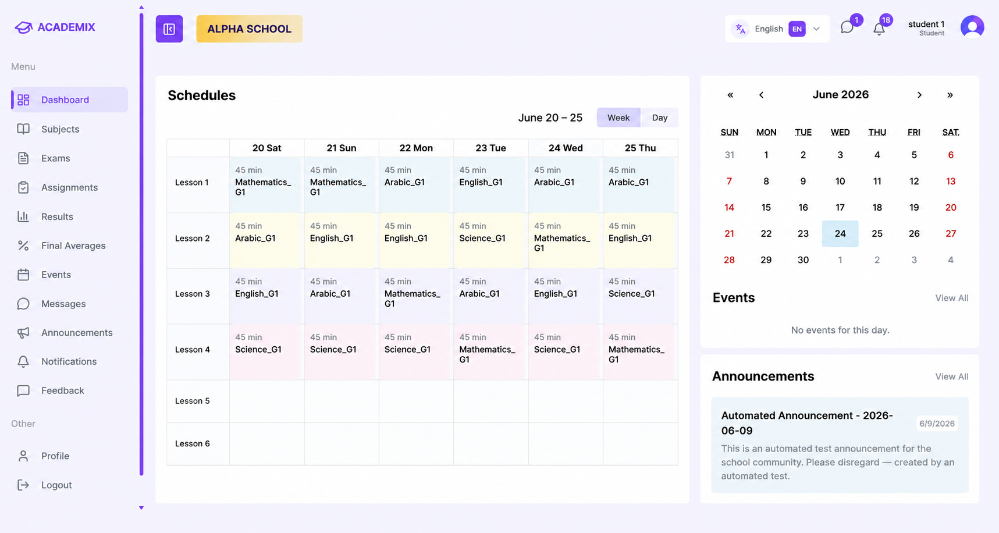
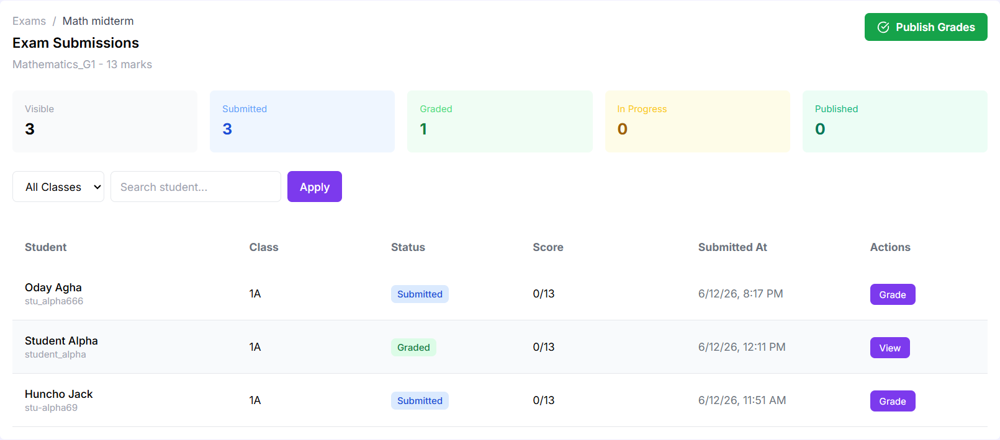
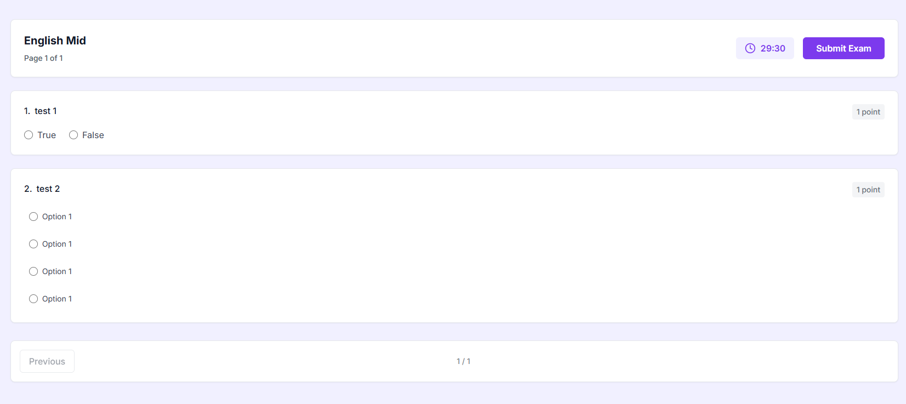
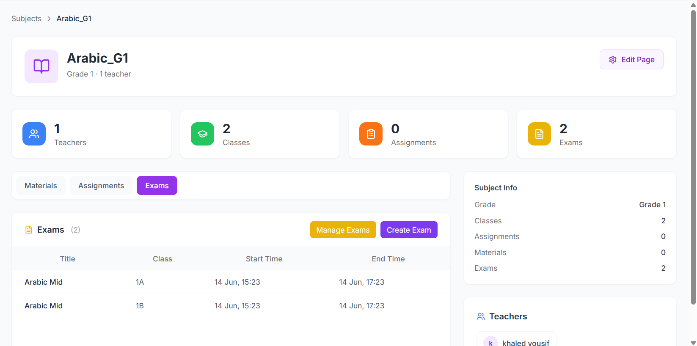
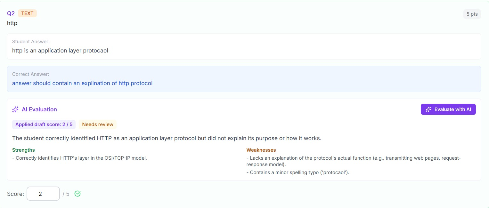

# Academix

Academix is a modern **School Management and Assessment System** designed to streamline academic operations and improve collaboration between administrators, teachers, students, and parents. It provides a centralized platform for managing users, classes, assessments, attendance, communication, and academic performance through dedicated role-based portals.

  

---

## 🚀 Live Demo

🔗 https://academix-edu.vercel.app

---

## ✨ Features

### Administration

- Manage students, teachers, parents, and classes
- Organize academic years, subjects, and schedules
- School-wide analytics and reporting
- User and role management

### Teachers

- Create and manage assignments
- Create and manage online examinations
- Record attendance
- Grade submissions
- Publish results
- Manage announcements

### Students

- Access assignments and online exams
- Submit coursework
- View grades and academic performance
- Access schedules and announcements

### Parents

- Monitor student progress
- Track attendance records
- View grades
- Stay updated with school announcements

### Assessment System

- Multiple Choice Questions
- True / False Questions
- Text Answer Questions
- File Upload Questions
- Automatic Grading
- Manual Review
- AI-Assisted Evaluation
- Performance Tracking

---

## 👥 User Roles

- 👨‍💼 Administrator
- 👨‍🏫 Teacher
- 🎓 Student
- 👨‍👩‍👧 Parent

---

## 🛠️ Tech Stack

- **Frontend:** Next.js, React, TypeScript
- **Styling:** Tailwind CSS
- **Backend:** Next.js Server Actions
- **Database:** PostgreSQL, Prisma ORM
- **Authentication:** Clerk
- **Forms & Validation:** React Hook Form, Zod
- **Internationalization:** next-intl
- **AI Integration:** Google Gemini API
- **File Storage:** Cloudinary
- **Email:** Nodemailer
- **Data Visualization:** Recharts
- **Scheduling:** React Big Calendar
- **Deployment:** Vercel

---

## 📸 Screenshots

### Admin & Student Portals

  
  

Dedicated dashboards tailored to each role, providing quick access to courses, assignments, examinations, grades, and classroom management tools.

---

### Assessment System

  
  

Manage assessments, create online exams, and review student submissions through a streamlined workflow.

---

### Subject Virtual Classroom

  

A dedicated workspace for each subject where teachers and students can collaborate through announcements, assignments, learning materials, examinations, and discussions.

---

### AI-Assisted Evaluation

  

Teachers can leverage AI-generated grading suggestions and feedback for written responses while maintaining full control over the final evaluation.

---

## 🌟 Project Highlights

- Multi-tenant school architecture
- Role-based authentication and authorization
- Complete online examination workflow
- Assignment management
- Attendance tracking
- AI-assisted assessment evaluation
- Academic performance analytics
- Responsive design
- Secure file uploads
- Modern and intuitive user interface

---

## 📄 License

This project is intended for educational and demonstration purposes.
